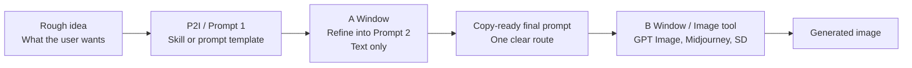
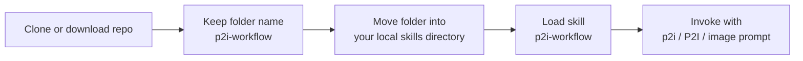

# P2I Workflow

[English](./README.md) | [简体中文](./README.zh-CN.md)

[](./LICENSE)
[](./README.zh-CN.md)
[](./p2i-workflow/SKILL.md)

> Prompt to Image Workflow
> Turn rough ideas into structured, copy-ready prompts that work across GPT Image, Midjourney, Stable Diffusion, and more.

P2I stands for `Prompt to Image`.

This repository is not an image generation app. It is a reusable `skill + prompt workflow` that helps users turn vague image ideas into clear final prompts before sending them to an image model.

## Why people click this

- `Copy-ready prompts`: get a prompt you can paste directly, not vague advice
- `Works across tools`: designed for `GPT Image`, `Midjourney`, `Stable Diffusion`, and similar workflows
- `Two-window discipline`: separate prompt writing from actual image generation
- `Chinese-first`: optimized for Chinese users without blocking English-first output
- `Installable skill`: use it as a `SKILL.md` skill or just copy the prompt template

## From rough idea to usable prompt

Before:

```txt
Make a futuristic singer poster, neon lights, cool style, for promotion.
```

After:

```txt
A structured final prompt with one clear direction, subject, scene, composition, lighting, style, Negative Prompt, replaceable variables, and a quality check.
```

This is the point of P2I: turn something fuzzy into something usable.

## Workflow at a glance



## Install flow



## Try it now

- Skill entry: [p2i-workflow/SKILL.md](./p2i-workflow/SKILL.md)
- Chinese Prompt 1: [p2i-workflow/prompts/prompt1-final-cn.md](./p2i-workflow/prompts/prompt1-final-cn.md)
- English Prompt 1: [p2i-workflow/prompts/prompt1-final-en.md](./p2i-workflow/prompts/prompt1-final-en.md)
- Workflow guide: [p2i-workflow/docs/workflow.md](./p2i-workflow/docs/workflow.md)
- Chinese README: [README.zh-CN.md](./README.zh-CN.md)

## Install this skill

### Option 1. Install as a reusable skill

If your agent platform supports `SKILL.md`-based skills:

1. Download or clone this repository
2. Keep the folder name as `p2i-workflow`
3. Put the whole folder into your local skills directory
4. Let your agent load `p2i-workflow`

Minimal structure:

```txt
skills/
└─ p2i-workflow/
   ├─ SKILL.md
   ├─ prompts/
   ├─ examples/
   └─ docs/
```

### Option 2. Use without installation

If you do not want to install a skill, just open one of these files and copy it into your AI chat:

- [p2i-workflow/prompts/prompt1-final-cn.md](./p2i-workflow/prompts/prompt1-final-cn.md)
- [p2i-workflow/prompts/prompt1-final-en.md](./p2i-workflow/prompts/prompt1-final-en.md)

## Trigger words

These phrases should naturally route to this workflow:

- `p2i`
- `P2I`
- `image prompt`
- `help me write an image prompt`
- `do not generate the image yet, give me the prompt first`
- `give me a copy-ready GPT Image prompt`
- `give me an English Midjourney-ready prompt`

Minimal invocation example:

```txt
use p2i-workflow
My rough idea is: a premium skincare bottle product image with clean lighting and elegant reflections.
Target tool: GPT Image
Preferred language: Chinese
```

## Core advantages

- `Copy-ready output`: exactly one code block for the final prompt section
- `Stable structure`: image type, direction, structure, final prompt, variables, versions, quality check
- `Safer prompting`: reduces style collision and accidental model overreach
- `Reusable method`: one workflow, many tools
- `Language flexibility`: Chinese-first by default, English when needed

## When to use Chinese vs English

### Use Chinese when

- your main target is `GPT Image / GPT Image 2 / 即梦 / 可灵`
- your working language is Chinese
- you want the workflow to stay readable for Chinese users
- you care more about idea clarity than English keyword portability

Recommended file:

- [p2i-workflow/prompts/prompt1-final-cn.md](./p2i-workflow/prompts/prompt1-final-cn.md)

### Use English when

- your main target is `Midjourney`, `Ideogram`, `Stable Diffusion`, or a more English-first ecosystem
- you want stronger cross-platform compatibility
- you need English style vocabulary, camera vocabulary, material vocabulary, or text-in-image reliability
- you are preparing prompts for a team or audience that already works in English

Recommended file:

- [p2i-workflow/prompts/prompt1-final-en.md](./p2i-workflow/prompts/prompt1-final-en.md)

### Simple rule

- Chinese-first workflow for Chinese users
- English-first workflow for broader tool compatibility
- If unsure, start in Chinese, then export to English when targeting Midjourney-like tools

## Best use cases

- Product shots
- Posters
- Character key visuals
- Toy and stylized scenes
- Social media campaign images
- E-commerce hero images
- Brand KV exploration

## Examples

- [p2i-workflow/examples/plush-toy-fight-example.md](./p2i-workflow/examples/plush-toy-fight-example.md)
- [p2i-workflow/examples/skincare-bottle-product-example.md](./p2i-workflow/examples/skincare-bottle-product-example.md)
- [p2i-workflow/examples/cyberpunk-poster-example.md](./p2i-workflow/examples/cyberpunk-poster-example.md)

## Open source files

- Contribution guide: [CONTRIBUTING.md](./CONTRIBUTING.md)
- Change history: [CHANGELOG.md](./CHANGELOG.md)
- Security policy: [SECURITY.md](./SECURITY.md)

## Compatibility

This workflow is optimized for Chinese long prompts first.

- `GPT Image / GPT Image 2 / 即梦 / 可灵` usually work well with the full Chinese prompt
- `Midjourney / Stable Diffusion / some other tools` may treat formatting and `Negative Prompt` differently
- If a platform does not work well with the full structure, keep the main final prompt first and adapt from there

## Repository structure

```txt
repo-root/
├─ README.md
├─ README.zh-CN.md
├─ LICENSE
├─ CONTRIBUTING.md
├─ CHANGELOG.md
├─ SECURITY.md
└─ p2i-workflow/
   ├─ SKILL.md
   ├─ prompts/
   ├─ examples/
   └─ docs/
```

## Workspace skill entry

If you use Codex / OpenCode inside `D:\VsCodeProjects`, you can also mount the local workspace entry skill:

- `D:/VsCodeProjects/.trae/skills/trae-p2i-workflow/SKILL.md`

That local entry skill points back to this repository as the source of truth.

## Reference sites

These sites are used only to study prompt structure, composition patterns, and professional phrasing:

1. [EvoLink GPT Image 2 Prompts](https://evolink.ai/zh/gpt-image-2-prompts)
2. [GPT Image 2 Prompt Gallery](https://gpt-image2.canghe.ai/)

This project does not copy or redistribute raw prompts from those websites.

## Acceptance

See [p2i-workflow/docs/acceptance.md](./p2i-workflow/docs/acceptance.md).

## License

[MIT](./LICENSE)
