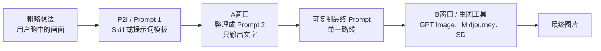
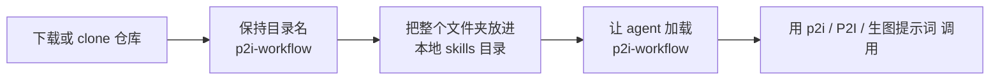

# P2I Workflow

[English](./README.md) | [简体中文](./README.zh-CN.md)

[](./LICENSE)
[](./README.zh-CN.md)
[](./p2i-workflow/SKILL.md)

> Prompt to Image Workflow
> 把粗略想法整理成结构化、可直接复制的生图提示词，可用于 GPT Image、Midjourney、Stable Diffusion 等主流工具。

P2I 是 `Prompt to Image` 的缩写。

这不是一个生图产品，而是一套可复用的 `skill + prompt workflow`。它的重点不是“直接出图”，而是先把模糊想法整理成稳定、清晰、可复制的最终 Prompt，再交给生图模型执行。

## 为什么别人会点进来

- `可直接复制`：拿到的是能直接粘贴使用的 Prompt，不是泛泛建议
- `跨工具可用`：同一套方法可覆盖 `GPT Image`、`Midjourney`、`Stable Diffusion` 等
- `两窗口分工清晰`：先写 Prompt，再生图，减少跑偏
- `中文优先`：更适合中文用户表达复杂想法
- `可安装成 skill`：既能当 `SKILL.md` 使用，也能直接复制提示词模板

## 从粗略想法到可用 Prompt

输入前：

```txt
做一张未来感女歌手宣传海报，霓虹灯，酷一点。
```

输出后：

```txt
一个已经整理好的最终 Prompt，里面有单一主路线、主体、场景、构图、光影、风格、Negative Prompt、可替换变量和质量检查。
```

这就是 P2I 的价值：把“模糊想法”变成“可直接使用的 Prompt”。

## 一眼看懂工作流



## 安装流程图



## 立即使用

- Skill 入口：[p2i-workflow/SKILL.md](./p2i-workflow/SKILL.md)
- 中文 Prompt 1：[p2i-workflow/prompts/prompt1-final-cn.md](./p2i-workflow/prompts/prompt1-final-cn.md)
- 英文 Prompt 1：[p2i-workflow/prompts/prompt1-final-en.md](./p2i-workflow/prompts/prompt1-final-en.md)
- 工作流说明：[p2i-workflow/docs/workflow.md](./p2i-workflow/docs/workflow.md)
- 英文 README：[README.md](./README.md)

## 安装这个 skill

### 方式 1：安装成可复用 skill

如果你的 agent 平台支持 `SKILL.md`：

1. 下载或 clone 这个仓库
2. 保持文件夹名字为 `p2i-workflow`
3. 把整个文件夹放进你的本地 skills 目录
4. 让 agent 加载 `p2i-workflow`

最小目录结构：

```txt
skills/
└─ p2i-workflow/
   ├─ SKILL.md
   ├─ prompts/
   ├─ examples/
   └─ docs/
```

### 方式 2：不安装，直接使用

如果你不想安装 skill，也可以直接打开下面任意一个文件，复制到 AI 对话里：

- [p2i-workflow/prompts/prompt1-final-cn.md](./p2i-workflow/prompts/prompt1-final-cn.md)
- [p2i-workflow/prompts/prompt1-final-en.md](./p2i-workflow/prompts/prompt1-final-en.md)

## 触发词

这些说法都适合触发这套工作流：

- `p2i`
- `P2I`
- `生图提示词`
- `帮我写生图提示词`
- `先不要生图，先给我 Prompt`
- `给我一个可直接复制的 GPT Image Prompt`
- `给我一个适合 Midjourney 的英文 Prompt`

最小调用示例：

```txt
use p2i-workflow
我的粗略想法是：做一张高端护肤品瓶身产品图，干净背景，玻璃质感，柔和高光。
目标工具：GPT Image
偏好语言：中文
```

## 核心优点

- `可复制输出`：最终 Prompt 部分固定为一个代码块，拿来就能用
- `结构稳定`：图片类型、方向、结构、最终 Prompt、变量、版本、质量检查一套固定
- `更不容易跑偏`：减少多风格混杂和模型越权直接生图
- `同一方法可复用`：一套工作流适配多种生图工具
- `语言可切换`：中文优先，也能导向英文版本

## 什么时候用中文，什么时候用英文

### 用中文更合适

- 目标工具是 `GPT Image / GPT Image 2 / 即梦 / 可灵`
- 你的工作语言本来就是中文
- 你希望工作流对中文用户更好理解
- 你更在意想法表达清楚，而不是英文关键词迁移

推荐文件：

- [p2i-workflow/prompts/prompt1-final-cn.md](./p2i-workflow/prompts/prompt1-final-cn.md)

### 用英文更合适

- 目标工具是 `Midjourney`、`Ideogram`、`Stable Diffusion` 或其他英文生态工具
- 你更在意跨平台兼容性
- 你需要更稳定的英文风格词、镜头词、材质词或画面文字控制
- 你要把 Prompt 给英文团队或国际化场景使用

推荐文件：

- [p2i-workflow/prompts/prompt1-final-en.md](./p2i-workflow/prompts/prompt1-final-en.md)

### 一句话规则

- 中文用户默认先用中文 Prompt 1
- 如果目标是 Midjourney 这类英文生态工具，优先用英文 Prompt 1
- 如果拿不准，先用中文整理想法，再导出成英文版本去跑跨平台工具

## 适合的场景

- 产品图
- 海报
- 角色主视觉
- 玩具 / 场景图
- 社媒宣传图
- 电商主图
- 品牌 KV 探索

## 示例

- [p2i-workflow/examples/plush-toy-fight-example.md](./p2i-workflow/examples/plush-toy-fight-example.md)
- [p2i-workflow/examples/skincare-bottle-product-example.md](./p2i-workflow/examples/skincare-bottle-product-example.md)
- [p2i-workflow/examples/cyberpunk-poster-example.md](./p2i-workflow/examples/cyberpunk-poster-example.md)

## 开源协作文件

- 贡献说明：[CONTRIBUTING.md](./CONTRIBUTING.md)
- 更新记录：[CHANGELOG.md](./CHANGELOG.md)
- 安全策略：[SECURITY.md](./SECURITY.md)

## 兼容性说明

这套工作流优先面向中文长 Prompt：

- `GPT Image / GPT Image 2 / 即梦 / 可灵` 通常可以直接使用完整中文 Prompt
- `Midjourney / Stable Diffusion / 部分其他工具` 对格式和 `Negative Prompt` 的处理方式不同
- 如果平台不适合完整结构，优先保留主 Prompt 主体，再按平台特性微调

## 仓库结构

```txt
repo-root/
├─ README.md
├─ README.zh-CN.md
├─ LICENSE
├─ CONTRIBUTING.md
├─ CHANGELOG.md
├─ SECURITY.md
└─ p2i-workflow/
   ├─ SKILL.md
   ├─ prompts/
   ├─ examples/
   └─ docs/
```

## Workspace Skill 入口

如果你在 `D:\VsCodeProjects` 工作区内使用 Codex / OpenCode，也可以直接挂本地入口 skill：

- `D:/VsCodeProjects/.trae/skills/trae-p2i-workflow/SKILL.md`

这个本地入口 skill 会把当前仓库作为 `source of truth`。

## 推荐的 GitHub About 文案

推荐把仓库 About 写成：

`中文 AI 生图提示词 Skill，用 p2i / P2I / 生图提示词 即可调用；copy-ready prompts that work across GPT Image, Midjourney, Stable Diffusion and more.`

## 参考网站

以下网站只用于学习提示词结构、构图方式和专业写法：

1. [EvoLink GPT Image 2 Prompts](https://evolink.ai/zh/gpt-image-2-prompts)
2. [GPT Image 2 Prompt Gallery](https://gpt-image2.canghe.ai/)

本项目不复制、不搬运或二次分发这些网站的原始 Prompt 内容。

## 验收标准

见 [p2i-workflow/docs/acceptance.md](./p2i-workflow/docs/acceptance.md)。

## License

[MIT](./LICENSE)
